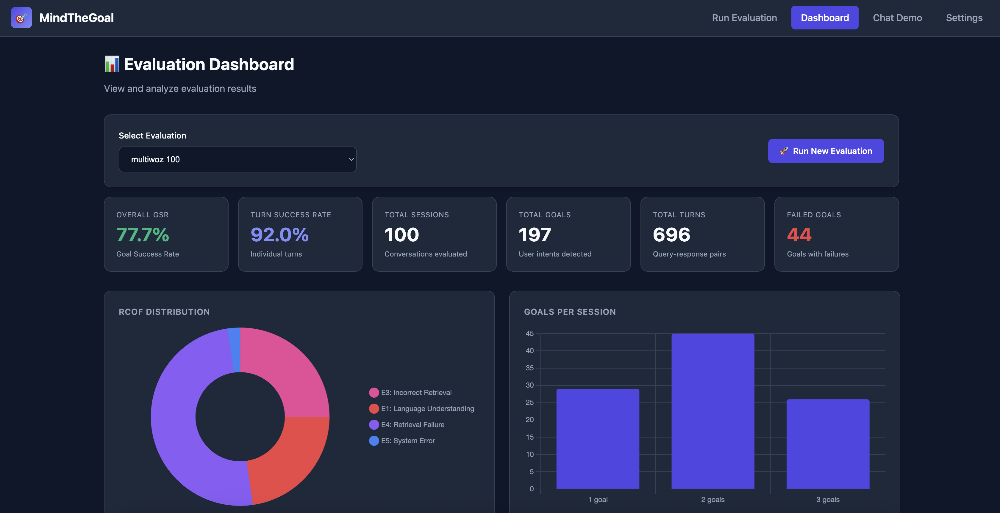
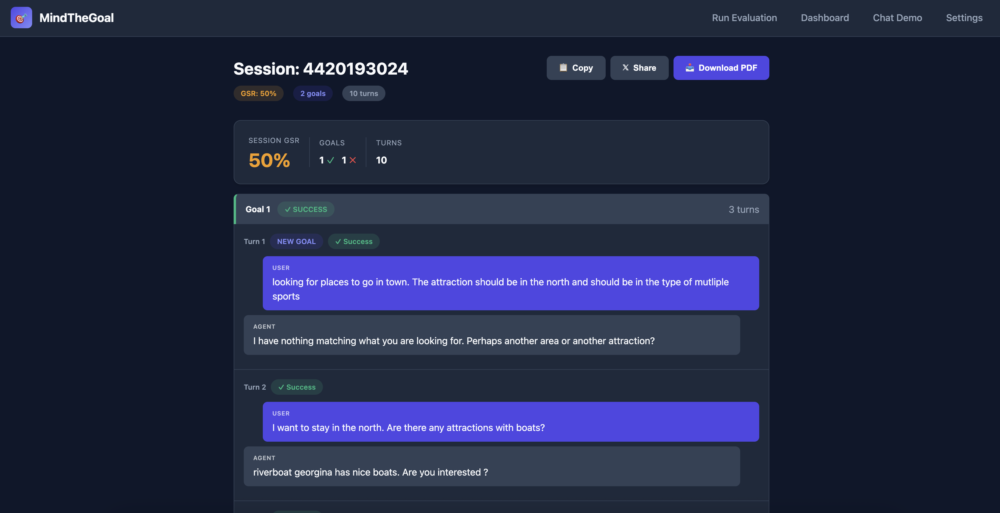

# 🎯 MindTheGoal

[](https://arxiv.org/abs/2510.03696)
[](https://arxiv.org/abs/2510.03696)

**Data-Efficient Goal-Oriented Evaluation of Conversational Agents and Chatbots using Teacher Models**

> 📚 **Based on:** Piskala, D.B., Chen, S., Patel, U., Kalra, P., & Castrillo, R. (2025). *"Mind the Goal: Data-Efficient Goal-Oriented Evaluation of Conversational Agents and Chatbots using Teacher Models"* [[arXiv:2510.03696](https://arxiv.org/abs/2510.03696)]

A comprehensive implementation of the MindTheGoal framework for evaluating multi-turn conversational agents at the **goal level** rather than turn level.

---

## 📋 Overview

Traditional chatbot evaluation focuses on individual turns, missing whether users actually achieved their goals. MindTheGoal addresses this by:

1. **Goal Segmentation**: Detecting when users start new goals vs. continue previous ones
2. **Goal Success Rate (GSR)**: Measuring the percentage of fulfilled goals (strict: all turns must succeed)
3. **Root Cause of Failure (RCOF)**: Categorizing failures into 7 actionable error types

## ✨ Features

- **Batch Evaluation**: Process multi-turn conversation datasets (MultiWOZ, custom datasets)
- **Interactive Chat**: Converse with an LLM agent while viewing real-time evaluation
- **Live Judge Panel**: See LLM-as-judge output with thinking tokens as you chat
- **GSR Dashboard**: Visualize goal success rates and RCOF distributions
- **AWS Bedrock Integration**: Uses Claude 3.5 Sonnet for chat and evaluation

---

## 📸 Screenshots

### Evaluation Dashboard
View overall GSR metrics, RCOF distribution charts, and detailed session results.



### Run Evaluation
Start new evaluations on MultiWOZ or custom datasets with configurable sample sizes.



### Dialog Viewer
Inspect individual conversation sessions with goal segmentation and turn-level evaluation.


---

## 🏗️ Architecture

```
┌─────────────────────────────────────────────────────────────────┐
│                         Frontend (React)                        │
│  ┌─────────────────┐  ┌─────────────────┐  ┌─────────────────┐  │
│  │ Chat Interface  │  │  Judge Panel    │  │ GSR Dashboard   │  │
│  └────────┬────────┘  └────────┬────────┘  └────────┬────────┘  │
└───────────┼────────────────────┼────────────────────┼───────────┘
            │ WebSocket          │ REST               │ REST
┌───────────┼────────────────────┼────────────────────┼───────────┐
│           ▼                    ▼                    ▼           │
│                      FastAPI Backend                            │
│  ┌─────────────────────────────────────────────────────────┐    │
│  │                    API Layer                            │    │
│  │  /chat (WebSocket)  │  /evaluate  │  /datasets          │    │
│  └──────────┬──────────┴──────┬─────┴──────────┬───────────┘    │
│             │                 │                │                │
│  ┌──────────▼─────────────────▼────────────────▼───────────┐    │
│  │                   Core Framework                        │    │
│  │  ┌──────────────┐ ┌─────────────┐ ┌──────────────────┐  │    │
│  │  │Goal Segment. │ │GSR Calculat.│ │RCOF Classifier   │  │    │
│  │  └──────────────┘ └─────────────┘ └──────────────────┘  │    │
│  └─────────────────────────┬───────────────────────────────┘    │
│                            │                                    │
│  ┌─────────────────────────▼───────────────────────────────┐    │
│  │              LLM Layer (AWS Bedrock)                    │    │
│  │  ┌─────────────────┐    ┌─────────────────────────┐     │    │
│  │  │   Chat Agent    │    │     Judge Agent         │     │    │
│  │  │ (Claude Sonnet) │    │ (Claude Sonnet + CoT)   │     │    │
│  │  └─────────────────┘    └─────────────────────────┘     │    │
│  └─────────────────────────────────────────────────────────┘    │
└─────────────────────────────────────────────────────────────────┘
```

---

## 🔑 Key Concepts

### Goal Success Rate (GSR)

A goal is successful **only if ALL its turns are successful**:

```
GSR = (Successful Goals / Total Goals) × 100%
```

### Root Cause of Failure (RCOF) Taxonomy

| Code | Category | Description |
|------|----------|-------------|
| E1 | Language Understanding | Misunderstood user's request or context |
| E2 | Refusal to Answer | Inappropriate refusal despite ability to help |
| E3 | Incorrect Retrieval | Retrieved wrong information (RAG issue) |
| E4 | Retrieval Failure | Failed to retrieve any relevant information |
| E5 | System Error | Technical issues (timeout, truncation) |
| E6 | Incorrect Routing | Query routed to wrong domain/module |
| E7 | Out-of-Domain | Request outside system's designed scope |

---

## 🚀 Quick Start

### Prerequisites

- Python 3.11+
- Node.js 18+ (for frontend)
- AWS Account with Bedrock access (Claude 3.7 Sonnet)

### Installation

```bash
# Clone the repository
git clone https://github.com/yourusername/MindTheGoal.git
cd MindTheGoal

# Create virtual environment
python -m venv venv
source venv/bin/activate  # On Windows: venv\Scripts\activate

# Install Python dependencies
pip install -r requirements.txt

# Configure AWS credentials
cp .env.example .env
# Edit .env with your AWS configuration

# Install frontend dependencies
cd frontend
npm install
cd ..
```

### Configure AWS

```bash
# Option 1: AWS CLI configuration
aws configure

# Option 2: Environment variables in .env
AWS_REGION=us-west-2
AWS_PROFILE=default
```

### Run the Application

```bash
# Start the backend server
python run_web.py

# In a new terminal, start the frontend
cd frontend
npm run dev
```

Visit `http://localhost:3000` to access the UI.

---

## 📊 Usage

### 1. Interactive Chat with Live Evaluation

1. Open the web interface
2. Start chatting with the agent
3. Watch the Judge Panel for real-time evaluation:
   - Goal segmentation (when new goals are detected)
   - Turn quality assessment (success/failure)
   - RCOF classification for failures
   - Running GSR calculation

### 2. Batch Dataset Evaluation

```bash
# Evaluate MultiWOZ dataset
python main.py evaluate --dataset multiwoz --sample 100

# Evaluate custom dataset
python main.py evaluate --dataset custom --path ./my_conversations.json
```

### 3. API Endpoints

```bash
# Start evaluation job
POST /api/evaluate
{
  "dataset": "multiwoz",
  "sample_size": 100
}

# Get evaluation results
GET /api/evaluate/{job_id}/results

# Chat with live judging (WebSocket)
WS /api/chat
```

---

## 📁 Project Structure

```
MindTheGoal/
├── config.py                  # Configuration management
├── main.py                    # CLI entry point
├── run_web.py                 # Web server entry point
├── requirements.txt           # Python dependencies
│
├── core/                      # Paper implementation
│   ├── models.py              # Session, Goal, Turn dataclasses
│   ├── goal_segmentation.py   # Goal boundary detection
│   ├── turn_evaluator.py      # Turn quality assessment
│   ├── gsr_calculator.py      # GSR computation
│   └── rcof_classifier.py     # E1-E7 taxonomy
│
├── llm/                       # LLM integration
│   ├── bedrock_client.py      # AWS Bedrock wrapper
│   ├── judge_agent.py         # LLM-as-judge
│   ├── chat_agent.py          # Conversational agent
│   └── prompts.py             # All LLM prompts
│
├── datasets/                  # Dataset management
│   ├── multiwoz_loader.py     # MultiWOZ parser
│   └── data/                  # Dataset files
│
├── evaluation/                # Batch evaluation
│   ├── batch_evaluator.py     # Process batches
│   └── report_generator.py    # Generate reports
│
├── web/                       # FastAPI backend
│   ├── app.py                 # FastAPI application
│   └── api/                   # API endpoints
│
├── frontend/                  # React UI
│   └── src/
│       └── components/
│           ├── ChatInterface.tsx
│           ├── JudgePanel.tsx
│           └── GSRDashboard.tsx
│
└── tests/                     # Test suite
```

---

## 🧪 Datasets

### Supported Datasets

| Dataset | Description | Size | Domains |
|---------|-------------|------|---------|
| **MultiWOZ 2.4** | Task-oriented dialogues | ~10K dialogues | Restaurant, Hotel, Taxi, Train, Attraction |
| **Custom JSON** | Your own conversations | Variable | Custom |

### Custom Dataset Format

```json
{
  "dialogues": [
    {
      "dialogue_id": "conv_001",
      "turns": [
        {
          "turn_id": 1,
          "user": "I need a restaurant in the center of town",
          "system": "I found several restaurants. What cuisine do you prefer?"
        },
        {
          "turn_id": 2,
          "user": "Italian please",
          "system": "I recommend 'Pasta Palace' at 123 Main St. Would you like to book?"
        }
      ]
    }
  ]
}
```

---

## 📈 Sample Output

### GSR Report

```
═══════════════════════════════════════════════════════════════
                    MindTheGoal Evaluation Report
═══════════════════════════════════════════════════════════════

Dataset: MultiWOZ 2.4 (100 dialogues)
Evaluation Date: 2026-01-23

───────────────────────────────────────────────────────────────
                         Summary Metrics
───────────────────────────────────────────────────────────────

Total Dialogues:        100
Total Goals:            287
Total Turns:            1,432

Overall GSR:            72.3%
Single-turn GSR:        81.2%
Multi-turn GSR:         65.8%

───────────────────────────────────────────────────────────────
                    Root Cause of Failure (RCOF)
───────────────────────────────────────────────────────────────

E4 - Retrieval Failure:        35.2%  ████████████████
E1 - Language Understanding:   27.8%  █████████████
E3 - Incorrect Retrieval:      18.1%  █████████
E5 - System Error:             11.3%  █████
E2 - Refusal to Answer:         4.9%  ██
E6 - Incorrect Routing:         2.7%  █
E7 - Out-of-Domain:             0.0%  

═══════════════════════════════════════════════════════════════
```

---

## 🔧 Configuration

### Customizing RCOF Categories

The RCOF (Root Cause of Failure) taxonomy can be customized for your use case. Edit `config/rcof_config.json`:

```json
{
  "rcof_categories": [
    {
      "code": "E1",
      "name": "Language Understanding",
      "description": "Agent misunderstood user's request, context, or intent",
      "examples": ["Misinterpreting a booking request", "Wrong entity extraction"]
    },
    {
      "code": "E8",
      "name": "Custom Category",
      "description": "Your custom failure category for domain-specific errors",
      "examples": ["Example 1", "Example 2"]
    }
  ]
}
```

You can:
- **Add new categories**: Define domain-specific failure types (E8, E9, etc.)
- **Modify descriptions**: Tailor to your specific use case
- **Update examples**: Provide relevant examples for your domain
- **Remove categories**: Comment out categories that don't apply

The Settings page (`/settings`) also provides a UI to edit these configurations.

### Environment Variables

| Variable | Description | Default |
|----------|-------------|---------|
| `AWS_REGION` | AWS region for Bedrock | `us-west-2` |
| `AWS_PROFILE` | AWS credentials profile | `default` |
| `BEDROCK_MODEL_ID` | Claude model ID | `anthropic.claude-3-5-sonnet-20241022-v2:0` |
| `JUDGE_TEMPERATURE` | Temperature for judge | `0.1` |
| `CHAT_TEMPERATURE` | Temperature for chat agent | `0.7` |
| `MAX_TOKENS` | Max tokens per response | `4096` |
| `LOG_LEVEL` | Logging level | `INFO` |

---

## 📖 Citation

If you use this implementation, please cite the original paper:

```bibtex
@misc{piskala2025mindgoaldataefficientgoaloriented,
      title={Mind the Goal: Data-Efficient Goal-Oriented Evaluation of Conversational Agents and Chatbots using Teacher Models}, 
      author={Deepak Babu Piskala and Sharlene Chen and Udita Patel and Parul Kalra and Rafael Castrillo},
      year={2025},
      eprint={2510.03696},
      archivePrefix={arXiv},
      primaryClass={cs.AI},
      url={https://arxiv.org/abs/2510.03696}, 
}
```

---

## 📚 References

- **Paper**: [Mind the Goal: Data-Efficient Goal-Oriented Evaluation of Conversational Agents and Chatbots using Teacher Models](https://arxiv.org/abs/2510.03696)
- **MultiWOZ**: [Multi-Domain Wizard-of-Oz Dataset](https://github.com/budzianowski/multiwoz)
- **AWS Bedrock**: [Amazon Bedrock Documentation](https://docs.aws.amazon.com/bedrock/)

---

## 📄 License

MIT License - see [LICENSE](LICENSE) for details.

---

## 🤝 Contributing

Contributions are welcome! Please read our contributing guidelines before submitting PRs.

---

*Inspired by the MindTheGoal paper from Amazon.com*
